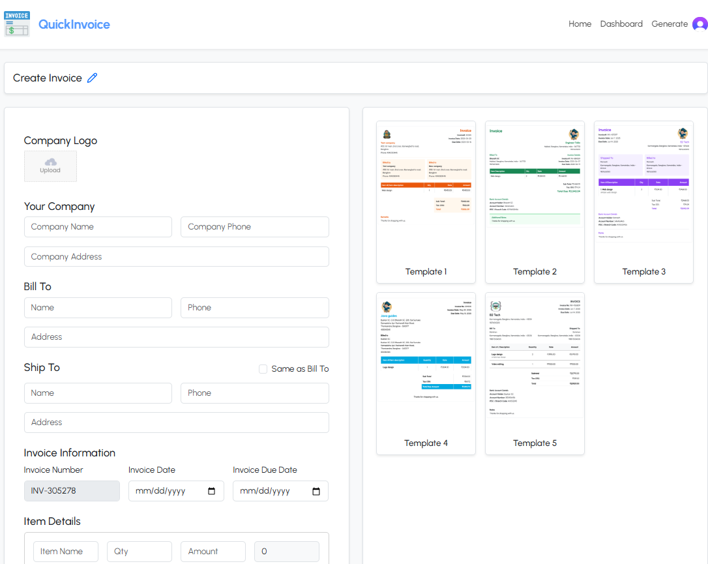
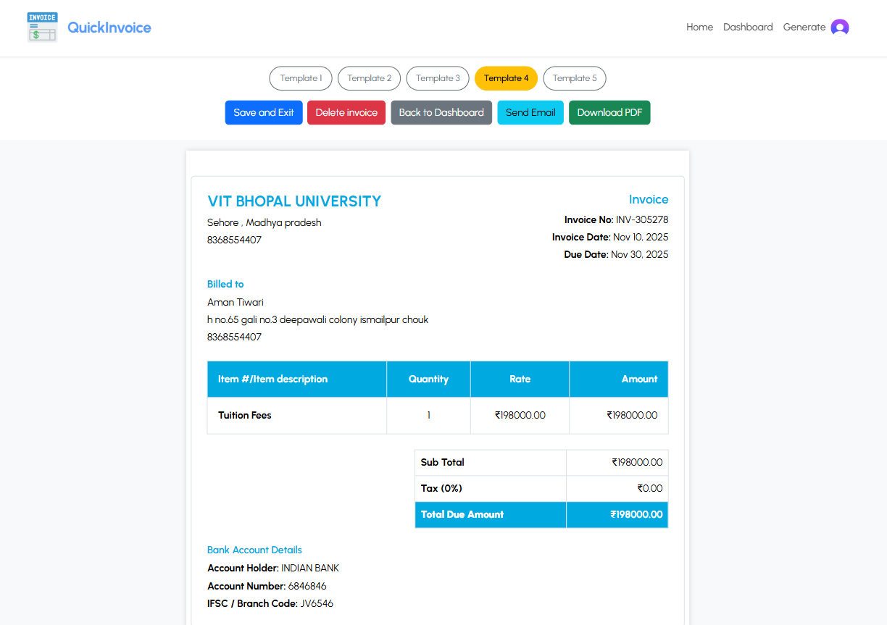

# 💼 QuickInvoice — Full-Stack Invoice Generator

  
  
<strong>Effortless invoicing. Professional results.</strong> 
  QuickInvoice helps freelancers, consultants, and small businesses create, send, and manage invoices in minutes.

  
  
  

---

## 🧾 About

QuickInvoice is a lightweight, full-stack invoice management application that enables users to **create, preview, download (PDF), send, and store invoices** securely. Built with a modern stack and focused on usability for freelancers and small businesses.

---

## ⚙️ Tech Stack

- **Frontend:** React (Vite)  
- **Backend:** Spring Boot  
- **Database:** MongoDB  
- **Auth:** Clerk  
- **Storage:** Cloudinary  
- **PDF Export:** jsPDF + html2canvas  
- **Email:** Brevo (Sendinblue)

---

## ✨ Key Features

- Create, preview, and save invoices  
- Multiple clean templates for invoice presentation  
- Download invoices as PDF (jsPDF + html2canvas)  
- Send invoices via email directly from the app  
- Secure auth with Clerk (frontend + backend JWT validation)  
- Store logos/templates in Cloudinary  
- Persist invoices in MongoDB  
- Responsive UI for desktop and mobile

---

## 🖼️ Screenshots

### 🏠 Landing Page

### 🧾 Create Invoice

### 📄 Invoice Preview 

---

## ⚙️ Environment Setup

### 🌐 Frontend (`.env`)
VITE_CLERK_PUBLISHABLE_KEY=<your_clerk_key>  
VITE_API_BASE_URL=http://localhost:8080/api  
VITE_CLOUDINARY_CLOUD_NAME=<cloud_name>  
VITE_CLOUDINARY_UPLOAD_PRESET=<upload_preset>  

---

### ☕ Backend (`application.properties`)
spring.data.mongodb.uri=mongodb+srv://<user>:<password>@cluster.mongodb.net/invoicedb  

# Clerk Authentication  
clerk.issuer=https://<your-clerk-api>  
clerk.jwks-url=https://<your-clerk-jwks-url>  
clerk.webhook.secret=<your-webhook-secret>  

# Brevo Email Setup  
spring.mail.host=smtp-relay.sendinblue.com  
spring.mail.port=587  
spring.mail.username=<your_email>  
spring.mail.password=<your_password>  
spring.mail.properties.mail.smtp.from=no-reply@quickinvoice.com  
